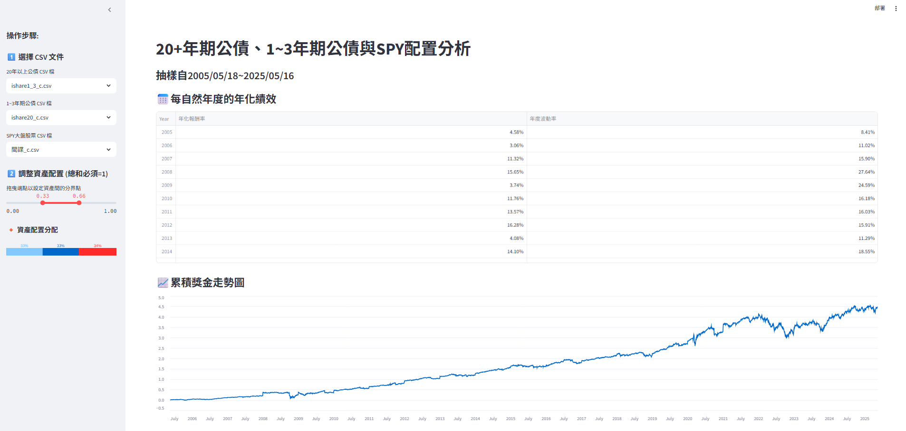

# Stock VS Bond
<p align="center">
  <a href="https://github.com/coconutbee/stockVSbond" target="_blank">
    
  </a>
  <a href="https://stockvsbond.streamlit.app/" target="_blank">
    
  </a>
  <a href="#installation-and-usage">
    
  </a>
</p>

Welcome to this repository! We aim to explore the optimal stock-to-bond allocation strategy.
We consider three components in our analysis: 
 - 20-year Treasury bonds
 - 1–3 year Treasury bonds
 - stock market index

Through simulating various asset allocation combinations, we analyze their performance under different market scenarios and assess their risk and return characteristics.
<p align="center">
  
</p>

## 🔍 Analysis Objectives and Methodology
Our objective is to provide an interactive tool that allows users to **adjust the allocation ratios** among three asset classes—**20-year Treasury bonds**, **1–3 year Treasury bonds**, and the **stock market index**.
Users can explore how different combinations affect the annualized return and **annual volatility**, helping them better understand the trade-off between risk and return.

## 🧰 Features

- 📈 **Asset Allocation Simulation**: Simulate investment portfolio performance with varying stock and bond ratios.
- 📊 **Interactive Charts**: Utilize Streamlit to provide intuitive graphical interfaces for data exploration.
- 🧪 **Risk Analysis Tools**: Calculate and compare risk metrics such as volatility and maximum drawdown across different allocations.
<p align="center">
  
</p>

## 🛠️Installation and Usage 
### git clone this repo

```bash
git clone https://github.com/coconutbee/stockVSbond.git
```

### create env and install the requirements
```bash
conda create --name stockvsbond python=3.10
conda activate stockvsbond
pip install -r requirements.txt
```

### Launch the UI
```bash
streamlit run UI_test.py
```

## 📁Project Structure
```plaintext
stockVSbond/
├── adjust.py             # Functions for adjusting or rebalancing asset allocations
├── balance.py            # Logic for computing portfolio balances or returns
├── crawl.py              # Script for crawling or loading financial data
├── ishare1_3_c.csv       # Processed data for 1–3 year Treasury bond ETF (e.g., SHY)
├── ishare20_c.csv        # Processed data for 20-year Treasury bond ETF (e.g., TLT)
├── spy_c.csv             # Processed data for stock market index ETF (e.g., SPY)
├── UI.py                 # Streamlit UI script (alternate or simplified version)
├── UI_test.py            # Main Streamlit interface script for running the app
├── requirements.txt      # List of required Python packages
└── README.md             # Project documentation (this file)
```

## ⚠️Notes
 - The data used in this project is sourced from public datasets and is intended for academic research and educational purposes only.
 - Investing involves risks; the content of this project should not be considered as actual investment advice.
 
<p align="center">
  
</p>